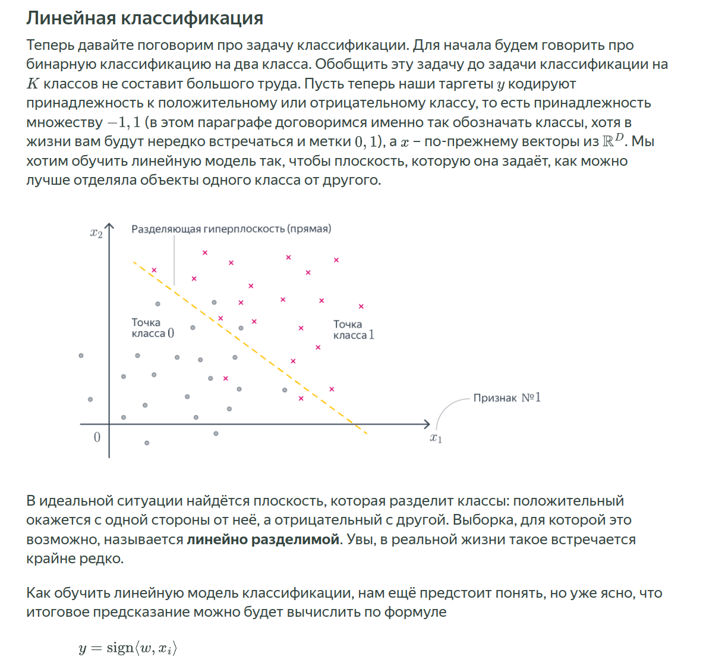
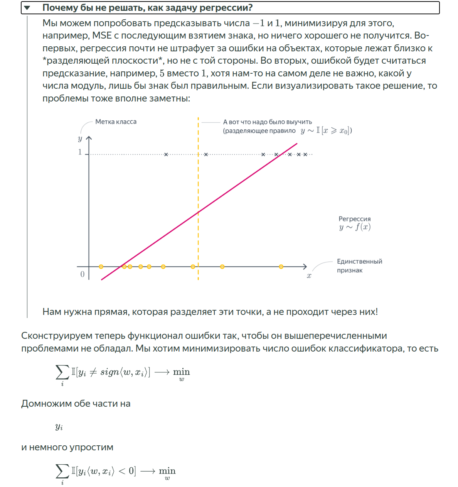
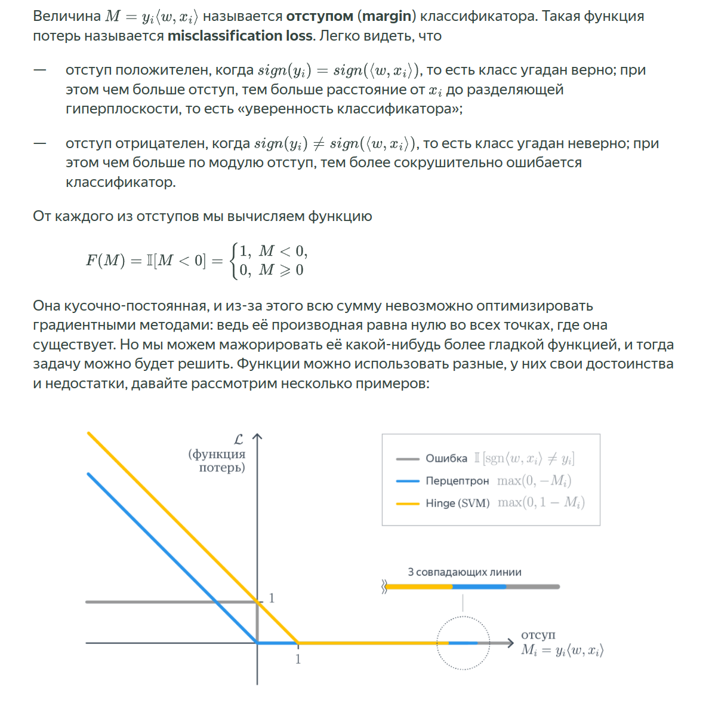
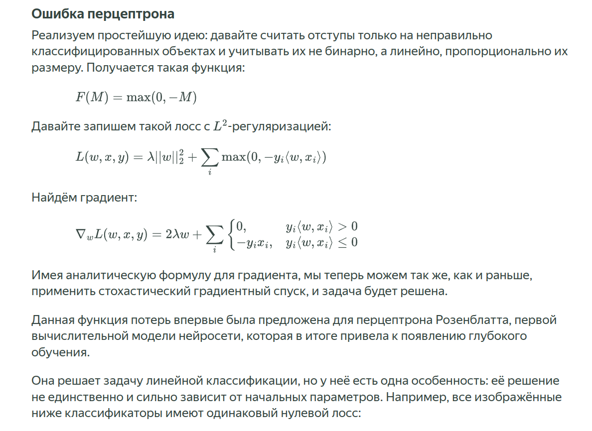
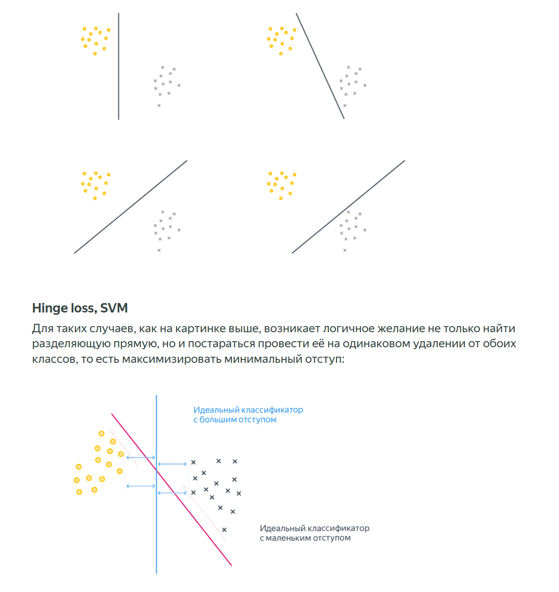
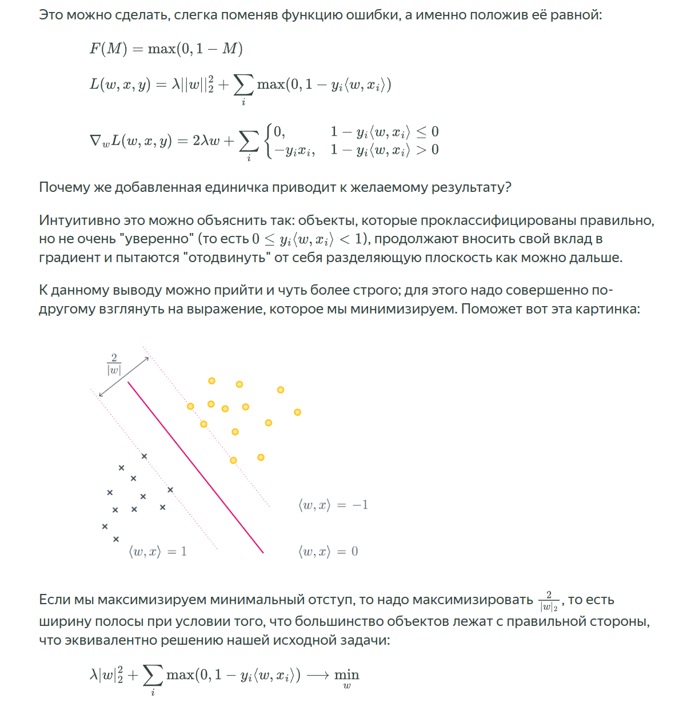
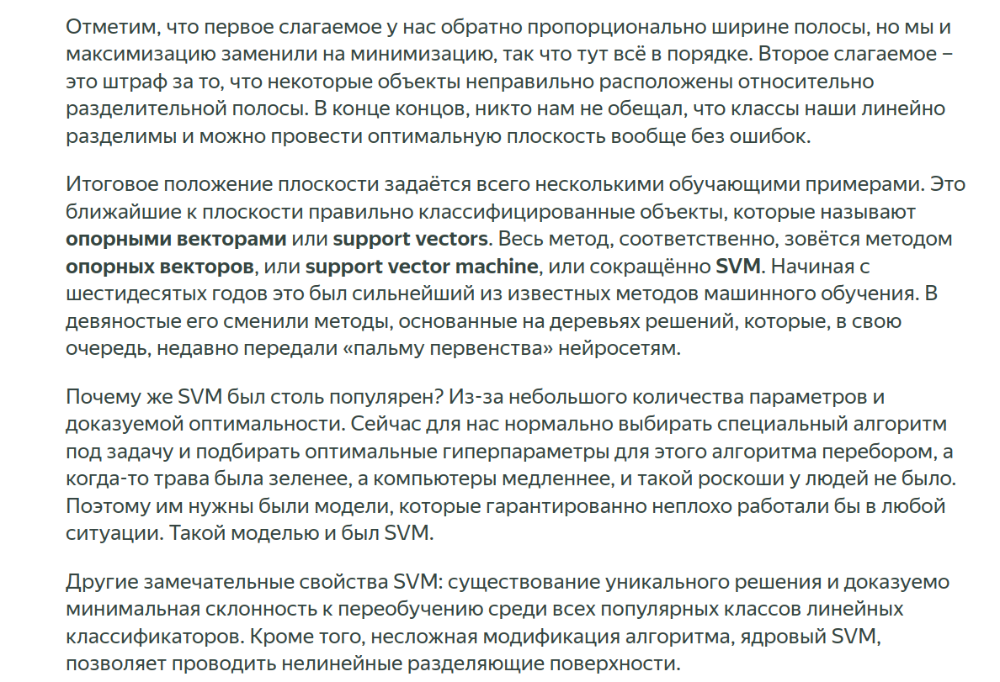
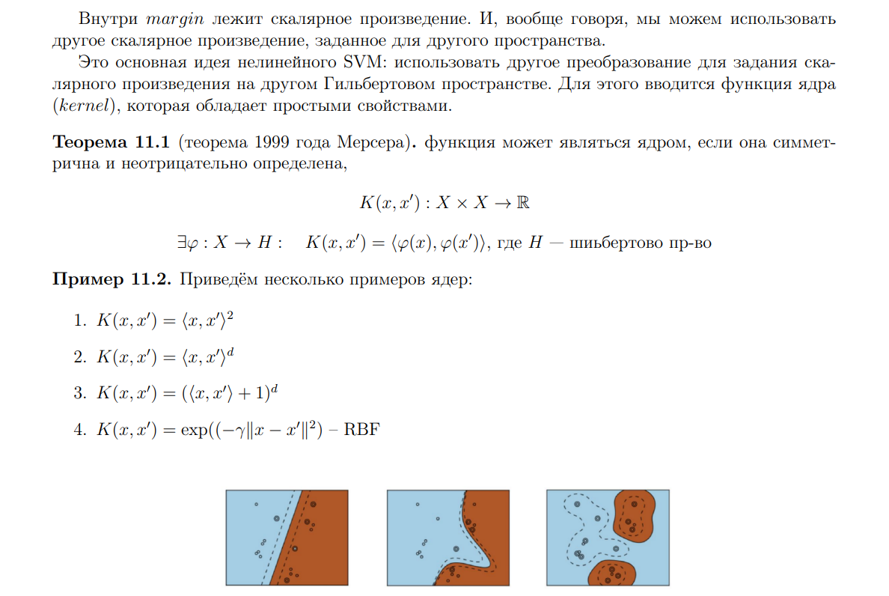

# Метод опорных векторов. Задача оптимизации для SVM. Трюк с ядром. Свойства ядра.

# Источники:
- [Хендбук 2.1](https://education.yandex.ru/handbook/ml/article/linear-models)
- [Candy Club, 11](./candy_club.pdf)