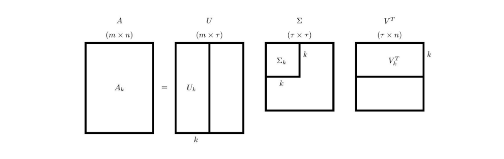

# Анализ главных компонент. Связь с SVD. Теорема Эккарта-Янга. Как применять PCA на практике.

### PCA (principal component analysis)

Анализ главных компонент - это метод линейного уменьшения размерности выборки. Т.е. он используется для уменьшения количества фич, попутно сохраняя наибольший процент информации. 

Пусть есть обучающая выборка $X_{m,n}$, тогда идея PCA в том, чтобы найти такие матрицы $T_{m,k},W_{k,n}$, что
$X \sim TW$. Тогда искомое преобразование будет задаваться матрицой, обратной к $W: X_k=XW^{-1}$.

Как измерить качество приближения? По обычной или Фредгольмовой норме: $\|X-TW\|\rightarrow min$.

### Связь с SVD (singular value decomposition).
SVD - сингулярное разложение матриц. Оно позволяет представить $X$ как произведение трех матриц: $X=U\Sigma V^T$, где $U,V$ - ортогональные матрицы (т.е. $U^TU=E=V^TV$), а $\Sigma$ - диагональная матрица.

Как с помощью SVD получить матрицы $T,W$?  
- Заметим, что все было бы круто, если бы матрица $\Sigma$ сразу была бы размеров $k \times k$, тогда в качестве $T$ можно было бы взять $U\Sigma$, а $W = V^T$.
- Как действовать в случае, когда размерность $\Sigma$ - больше $k$:  
    1. Упорядочить по неубыванию значения величин в матрице $\Sigma$ (это еще влечет перестановки в матрицах $U, v$). 
    2. Выбрать матрицы $U_k, \Sigma_k, V_k$ как на картинке ниже:  
    3. $T=U_k\Sigma_k$, а $W = V_k^T$.
### Теорема Эккарта-Янга.
(TL;DR;) Приведенный выше способ - лучше всего минимизрует выражение $\|X-TW\|$, т.е. дает лучшее разложение для перехода к размерности $k$.

### Как применять PCA на практике.

### Источники:
- [wiki/pca](https://en.wikipedia.org/wiki/Principal_component_analysis)
- [wiki/svd](https://ru.wikipedia.org/wiki/%D0%A1%D0%B8%D0%BD%D0%B3%D1%83%D0%BB%D1%8F%D1%80%D0%BD%D0%BE%D0%B5_%D1%80%D0%B0%D0%B7%D0%BB%D0%BE%D0%B6%D0%B5%D0%BD%D0%B8%D0%B5#%D0%9F%D1%80%D0%B8%D0%BB%D0%BE%D0%B6%D0%B5%D0%BD%D0%B8%D1%8F)
- [candy club, 12](./candy_club.pdf)
